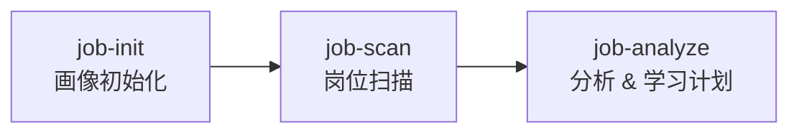

<div align="center">
  <h1>AI Job Hunter</h1>
  <p>AI 行业求职助手 — 画像分析 · 岗位扫描 · 差距分析 · 定制学习计划</p>

  <p>
    <a href="https://www.python.org/downloads/"></a>
    <a href="LICENSE"></a>
    <a href="https://claude.ai/claude-code"></a>
  </p>
</div>

> ⚠️ **利益中立声明**：本工具不会给你一份"AI 高薪岗位 Top10"那种水文清单——那些多是卖课/培训机构的获客漏斗。本工具基于 BOSS 直聘真实招聘数据，匹配你的实际底子，不做速成承诺。

---

## 工作流程



两步闭环：**了解你 → 找岗位 → 分析差距产出学习计划**

---

## 它能做什么

| 功能 | 说明 |
|------|------|
| **画像分析** | 采集技术栈、学历、经验、自驱力、可投入时间，判定起点档位 |
| **岗位扫描** | 通过 Chrome 连接 BOSS 直聘真实数据，按你的画像匹配岗位 |
| **JD 分析** | 分析市场需求，提取高频技能要求、薪资分布、经验门槛 |
| **差距分析** | 市场驱动（60%）+ 画像匹配（30%）+ 合理补充（10%）|
| **学习计划** | 30/60/90 天定制计划，含费曼学习法 + 第一性原理 |
| **技能变现** | 技术内容创作与技能变现模块（可选，不挤占核心学习）|
| **反诈检测** | 识别培训贷、包就业、付费内推等话术 |

---

## 快速开始

### 前置条件

- Python 3.10+
- Google Chrome
- [Claude Code](https://claude.ai/claude-code)（命令行或 IDE 扩展均可）

### 两步启动

**Windows**

```powershell
# 打开 PowerShell 或命令提示符，执行：
git clone https://github.com/qxiansheng001/ai-job-hunter.git
cd ai-job-hunter
claude .
# 然后在 Claude Code 中输入：
```
> "开始求职"

**macOS**

```bash
# 打开终端（Terminal），执行：
git clone https://github.com/qxiansheng001/ai-job-hunter.git
cd ai-job-hunter
claude .
# 然后在 Claude Code 中输入：
```
> "开始求职"

**Linux**

```bash
# 打开终端，执行：
git clone https://github.com/qxiansheng001/ai-job-hunter.git
cd ai-job-hunter
claude .
# 然后在 Claude Code 中输入：
```
> "开始求职"

### 之后会发生什么

skill 会自动帮你完成所有步骤：

```
① 自动安装 Python 依赖（无需手动 pip install）
② 采集你的技术栈、学历、经验 → 判定起点档位
③ 引导你启动 Chrome 并登录 BOSS直聘
④ 推荐匹配岗位 → 自动抓取真实数据
⑤ 生成市场需求分析报告 + 30/60/90 天定制学习计划
```

你只需要在引导下登录一次 BOSS直聘，其余都是自动的。

### 各平台 Chrome 启动方式

如果引导时需手动启动 Chrome，对应平台的命令：

```bash
# Windows（cmd）
start chrome --remote-debugging-port=9222

# macOS
open -a "Google Chrome" --args --remote-debugging-port=9222

# Linux
google-chrome --remote-debugging-port=9222
```

---

## 子命令

| 命令 | 触发方式 | 作用 |
|------|----------|------|
| `/job-init` | 首次使用自动触发 | 采集画像，判定 S0-S3 档位 |
| `/job-scan` | "帮我找岗位" | 推荐岗位 → CDP 抓取 → 清洗导出 |
| `/job-analyze` | 画像+扫描完成后自动可用 | JD 分析 → 差距分析 → 学习计划 |

---

## 配置

### 数据目录

所有个人数据存放在 skill 仓库**外部**，避免误提交：

默认：`../ai-job-hunter-data/`（skill 同级目录）

```bash
# 指定其他位置
export AI_JOB_HUNTER_DATA=/path/to/your/data
```

| 文件/目录 | 内容 |
|-----------|------|
| `.skill-state.json` | 个人画像、学习进度、历史记录 |
| `subjects/{keyword}/` | 岗位数据、JD 分析报告、学习计划 |
| `workspace/` | 每日打卡产出 |

### 爬虫参数

| 参数 | 默认 | 说明 |
|------|------|------|
| `CHROME_PORT` | `9222` | Chrome 远程调试端口 |

---

## 项目结构

```
ai-job-hunter/
├── SKILL.md                     Claude Code 入口（自动路由）
├── contents/themes.yaml         学习主题数据源
├── requirements.txt             Python 依赖
│
├── scripts/
│   ├── scraper/boss_scraper.py          BOSS直聘 CDP 爬虫
│   ├── export/clean_and_export.py       数据清洗 → Excel
│   ├── analysis/
│   │   ├── jd_analyzer.py               JD 市场需求分析
│   │   ├── gap_analyzer/                能力差距分析引擎
│   │   ├── content_generator.py         学习内容生成
│   │   ├── content_loader.py            YAML 数据加载
│   │   └── skill_map.py                 技能映射库
│   ├── utils/
│   │   ├── time.py                      时间计算工具
│   │   └── io.py                        文件 IO 工具
│   └── tests/                           单元测试（34 个）
│
├── skills/
│   ├── job-init/SKILL.md        画像初始化
│   ├── job-scan/SKILL.md        岗位扫描
│   └── job-analyze/SKILL.md     分析 & 学习计划
│
├── shared-references/
│   ├── role-tiers.md             起点档位判定
│   ├── analysis-rubric.md        分析方法论
│   └── city_codes.md             城市编码表
│
└── templates/state.template.json 状态文件模板
```

---

## 报告示例

### JD 分析报告

```
📊 JD 市场需求分析
目标岗位：大模型算法工程师  |  样本数：47 条
─────────────────────────────────────────
薪资分布
  25-50K: ████████████████████ 42%
  50-75K: ██████████████ 30%
  75K+:   ██████ 13%

学历要求
  硕士及以上: 58%  |  本科: 38%  |  不限: 4%

高频技能
  Python    ████████████████████ 87%
  PyTorch   ██████████████████ 82%
  Transformer ███████████████ 72%
  ...
```

### 学习计划

每日任务结构：

- **今日主题** — 具体学习范围
- **费曼输出** — 用大白话向小白讲清核心概念
- **实践任务** — 代码/项目实操
- **完成标准** — 可自检的 checklist

计划周期可选 30 天速成 / 60 天标准 / 90 天深入。

---

## 学习方法

### 费曼学习法

每天有「费曼输出任务」，要求你用大白话向小白讲清当天核心概念。卡住的地方就是盲区。

### 第一性原理

每阶段末有 5 层追问，回归：问题本质 → 核心原理 → 最小实现 → 设计取舍。

---

## 技术原理

| 层 | 技术 |
|------|------|
| 爬虫 | Chrome DevTools Protocol + websockets |
| 分析 | 中文分词 + 加权匹配算法 |
| 内容 | YAML 驱动，不硬编码 |
| 学习计划 | 市场驱动 60% + 画像匹配 30% + 补充 10% |

---

## 常见问题

| 问题 | 解决 |
|------|------|
| Chrome 连接失败 | 关闭所有 Chrome，用 `--remote-debugging-port=9222` 重启 |
| 抓取不到数据 | 检查 Chrome 中是否已登录 BOSS直聘 |
| pip install 报错 | 需要 Python 3.10+，建议用虚拟环境 |
| 模块找不到 | 在 skill 根目录执行 `pip install -r requirements.txt` |
| 岗位匹配少 | 尝试不同关键词或调整目标城市 |

---

## 贡献

欢迎提 Issue 和 PR。

1. Fork → Branch → PR
2. 新增功能请附带测试
3. 运行 `python -m pytest scripts/tests/` 确保通过

---

## License

MIT © [qxiansheng001](https://github.com/qxiansheng001)

---

<p align="center">如果这个工具对你有帮助，欢迎 ⭐ Star</p>
